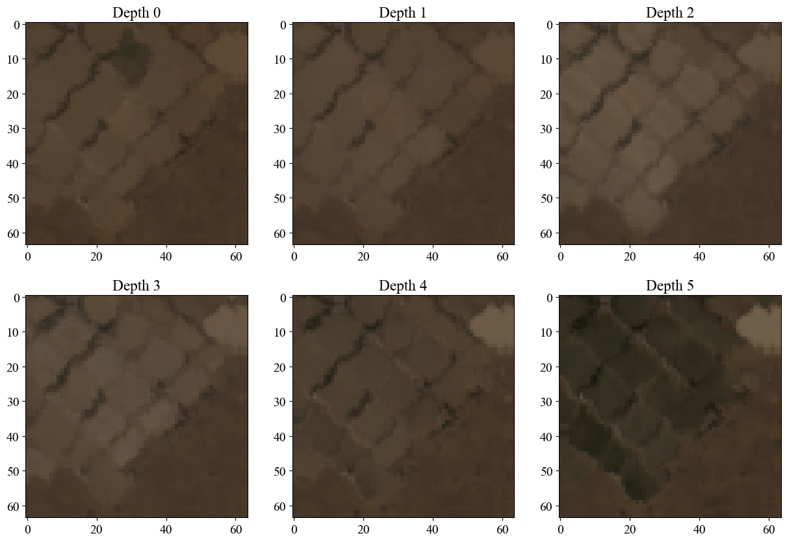
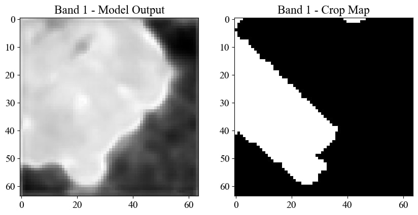

# CropMapping of Partially Annotated Time Series Satellite Images with 3D Convolutional Neural Networks


```
Supervised by: Dr. Sara Attarchi
Authors: Mohammad Ramezanpour, Moien Rangzan
```


The goal of the competition was to predict the crop type of a given time series of satellite images at least one month before the harvest. 

# Introduction

## Model
Our model is a Siamese 3D segmentation network that takes as input two time-series of Sentinel-1 and Sentinel-2 images, fuses them, and outputs a segmentation mask. 


## Training procedure
Since the dataset provided by ISRC is partially annotated, meaning that in each image, there might be un-annotated crops, we used transfer learning to train our model. 

- **Step 1**: First, we downloaded a dataset of around 150GB of data using Google Earth Engine(GEE), consisting of 6 months of Sentinel-1 and Sentinel-2 images and their corresponding annotations from [EUCROPMAP 2018 Dataset](https://developers.google.com/earth-engine/datasets/catalog/JRC_D5_EUCROPMAP_V1) freely available on GEE.
- **Step 2**: We trained our model on this dataset for 11 epochs.

- **Step 3**: Then we changed the segmentation head of our model and trained it on the ISRC dataset for 5 epochs, with a lower learning rate of `1e-5` for trained layers and `1e-4` for new layers.

This procedure enables the model to learn the features of the ISRC dataset while not forgetting the features of the EUCROPMAP dataset, and the low epoch number for the ISRC dataset prevents the model from overfitting on partially annotated data.


# How to use

**Clone the Repository**:
```bash
   git clone https://github.com/moienr/CropMapping.git
```

**Create the Environments**:

```bash
    conda env create -f geemap_reqs.yml
    conda env create -f pytorch_reqs.yml
```


## Dataset

The ISRC dataset is a in the form of a shapefile, for each crop, and an exel file containg the harvest time of each crop for each province of Iran.

In order to trnsfrom this dataset into a Image segmentation dataset, we converted the shapefiles into binary mases, and a clustering algorithm was used to cluster ROIs that were close to each other.

Then a Timseres of Sentinel-1 and Sentinel-2 images were downloaded for each ROI, and the images were patched into `64x64` patches.

### Clustering and Shapefile to Mask Conversion
A thorough explanation of how to build a dataset from ground truth shapefiles is provided in [main_dataset/README.md](./main_dataset/README.md)

### Downloading the Time Series Images
Then the new dataset ["main_dataset/output/Iran_ROI.xlsx"](./main_dataset/output/Iran_ROI.xlsx) can be downloaded using [Dataset Generator Notebook](./dataset/iran_ds_generator.ipynb).


## Evaluation
After building the dataset, you can evaluate the model on the dataset using the following command:

```bash
> conda activate pytorch_env
> python eval.py --eval_crop <crop_to_be_evaluated> --dataset_dir_path <path to dataset> --trained_model_path <path to trained model> -th <threshold>
```

**Note**: The dataset to that is used for evaluation must be fully annotated, for the metics to be calculated correctly.


### Example:

We can see that even though the ground truth is not fully annotated, the model can still predict the crop type of the un-annotated tomato field.






---
---

# How to fine-tune the model on your own dataset
Create the datasets for all the crops you want to train on using [Dataset Generator Notebook](./dataset/iran_ds_generator.ipynb).

In the [`config.py`](./config.py) set the paths to the datasets you want to train on (read the comments in the file for more information):

```python
DATASET_DIRS = ["./irandatasetcanolav1/",
                "./irandatasetcottonv1/",
                "./irandatasetlentilsv1/",
                "./irandatasetmaizev1/",
                "./irandatasetonionv1/",
                "./irandatastpeav1/",
                "./irandatasetsugarbeetv1/",
                "./irandatasettomatov1/"]
```

Then run the following command to train the model:

```bash
> conda activate pytorch_env
> python finetune.py --num_epoch <number of epochs> --batch_size <batch size> --save_model_dir <path to save the model> 
```


